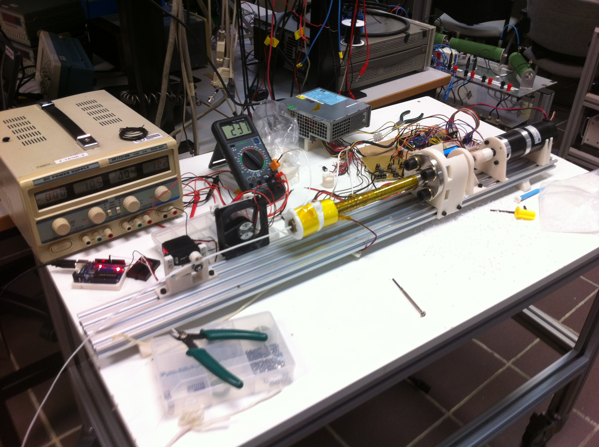
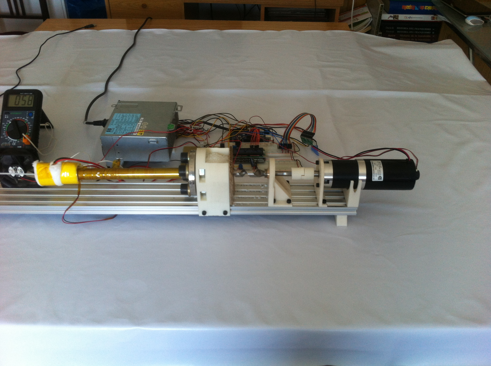
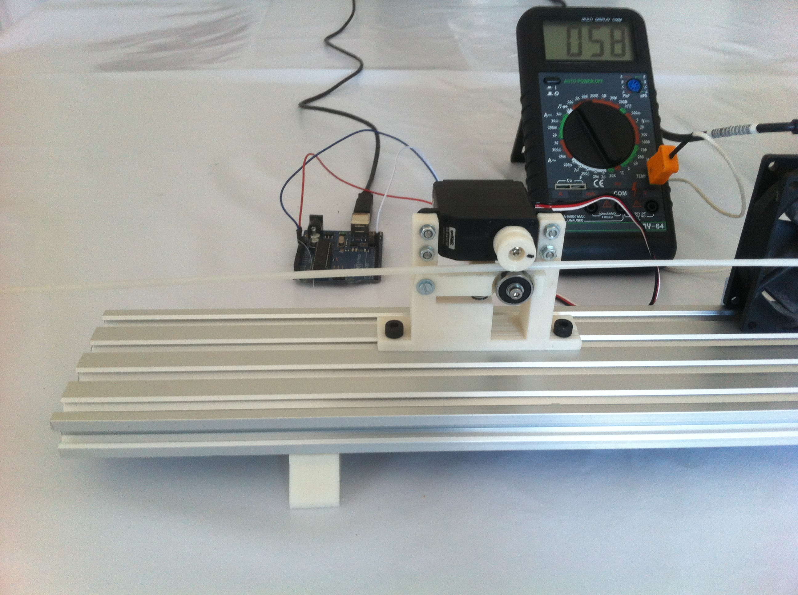
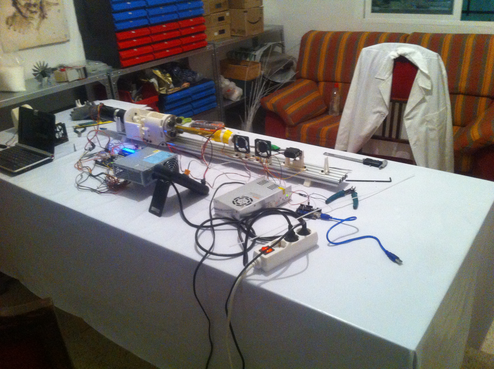
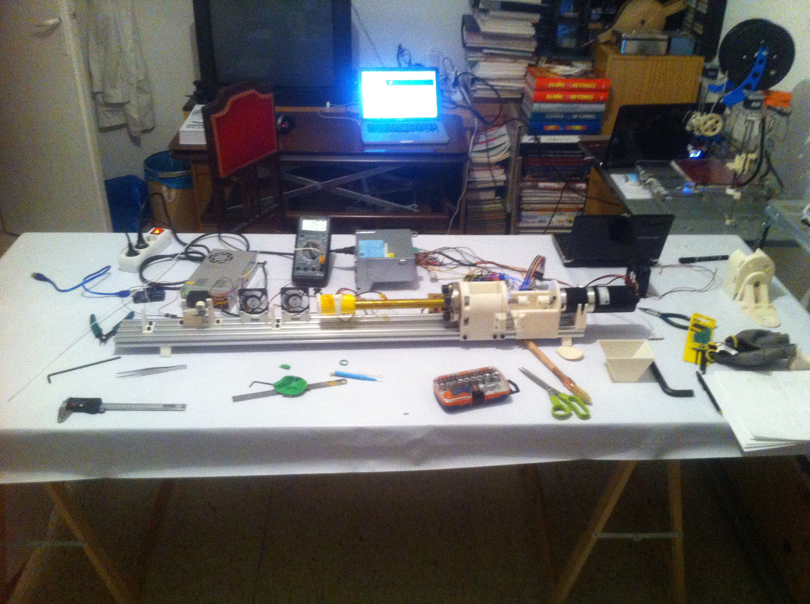
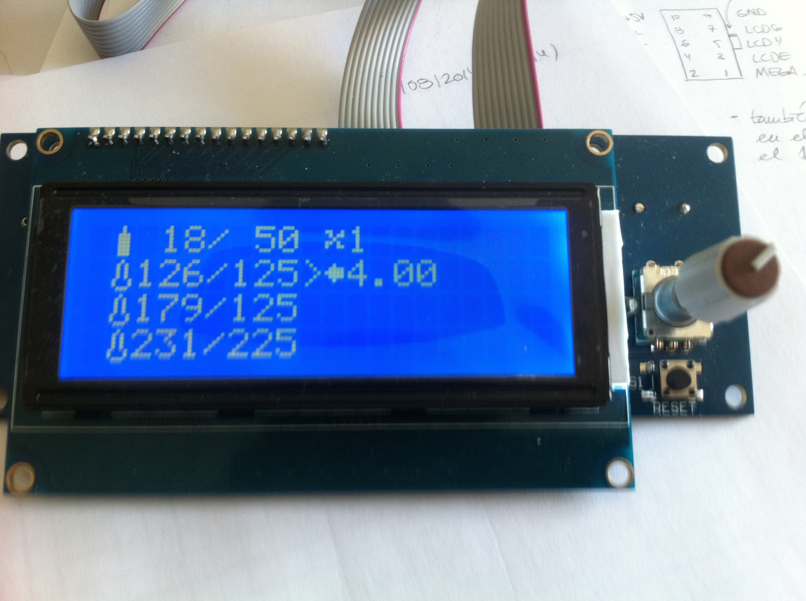

Filament Extruder
=================

Filament Extruder is a project dedicated to develop a simple, economic and easy to build filament extruding machine. It starts as an academic project at University Carlos III of Madrid, authored by Diego Trapero under the supervision of tutor Pablo Zumel Vaquero.

Currently the project is in prototyping and documenting phase, this is how the extruder looks right now:

