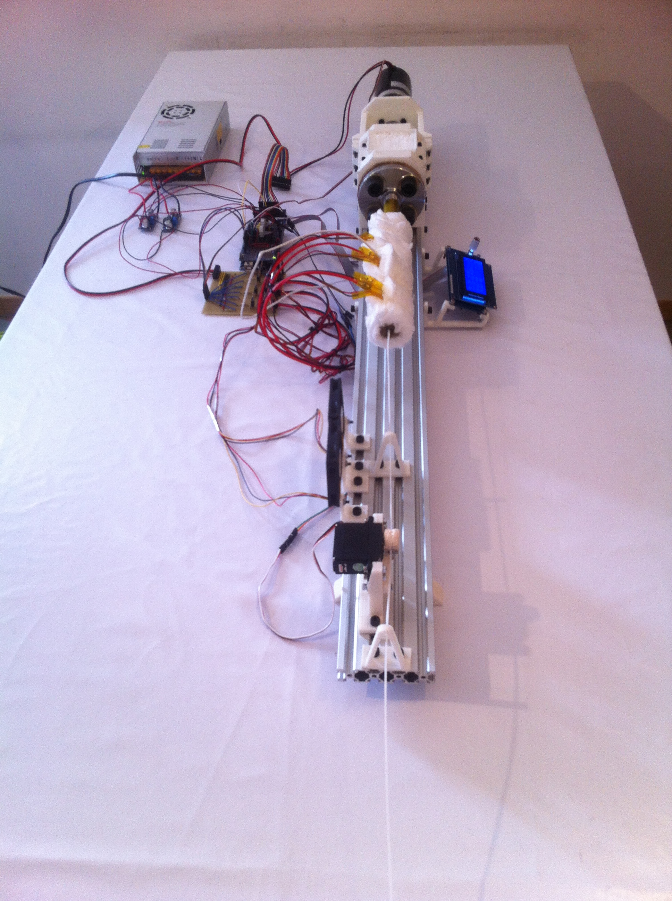
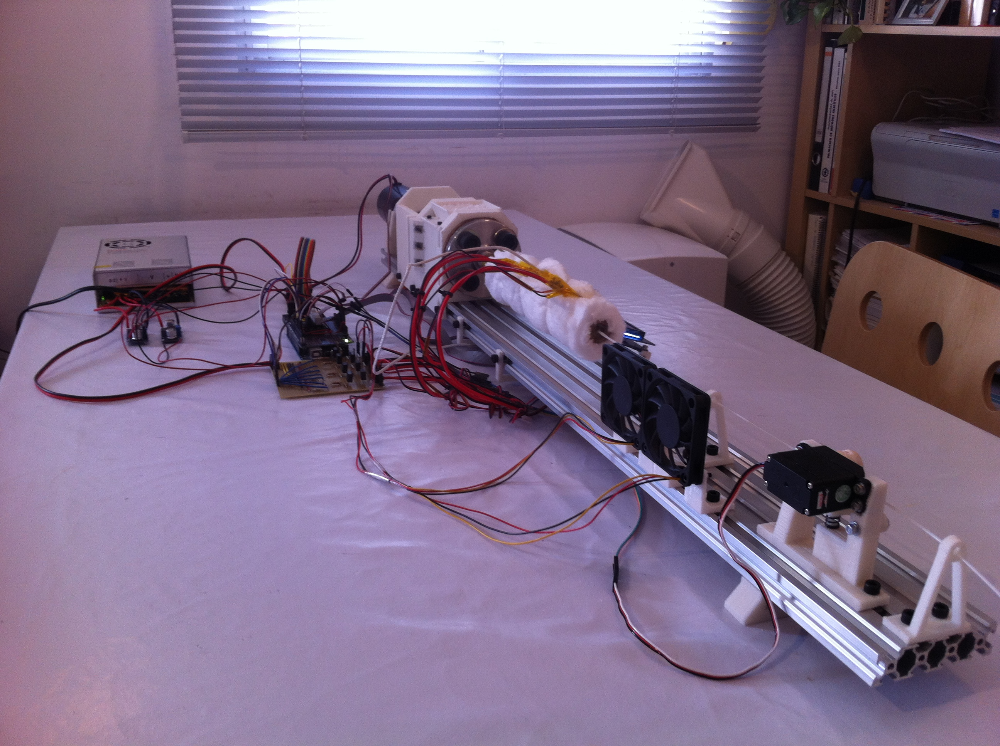
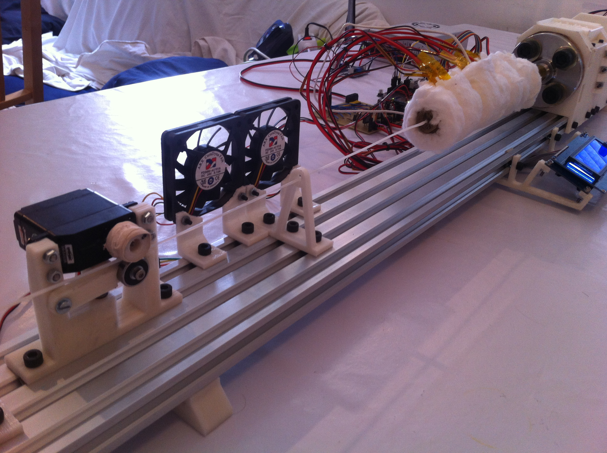
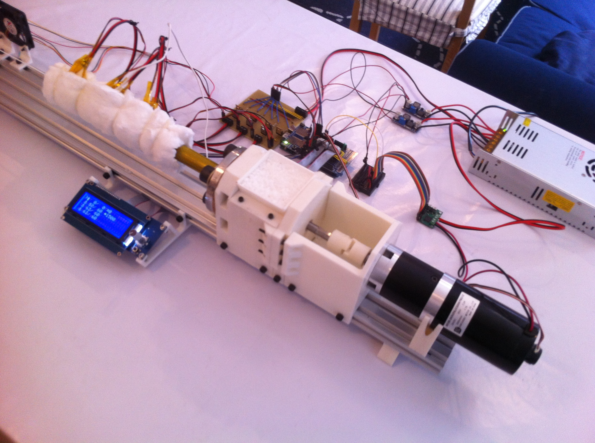
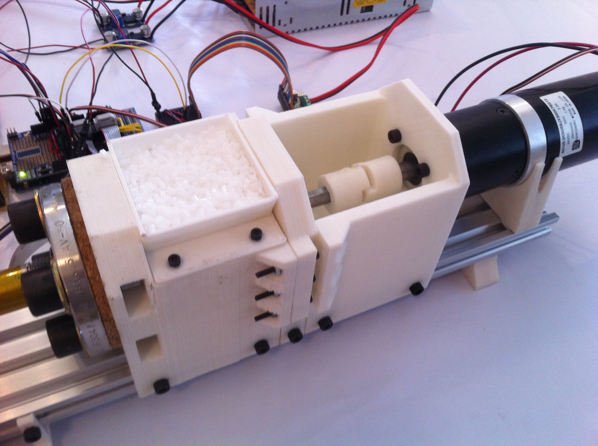
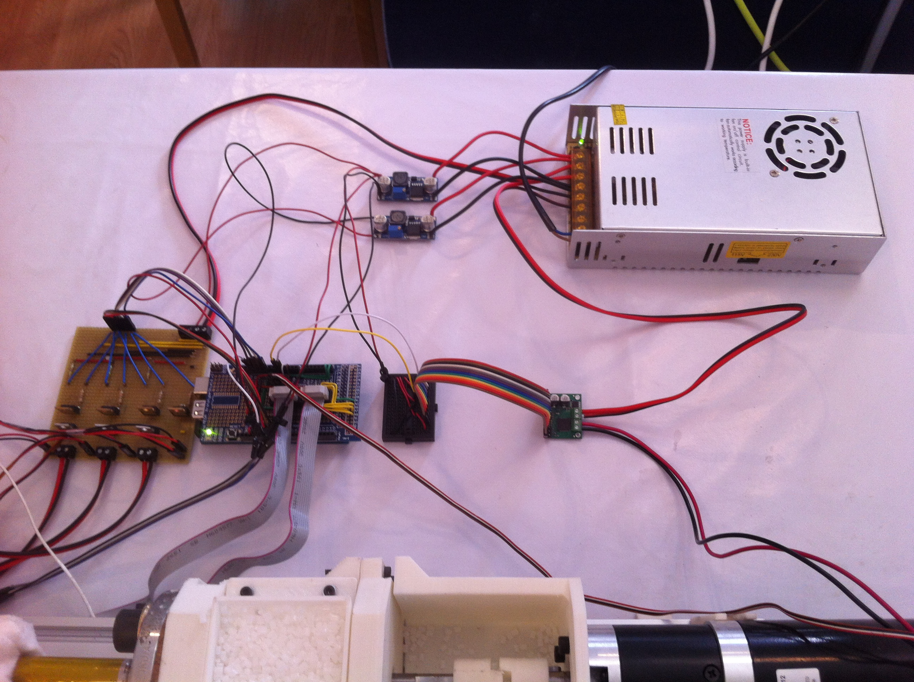
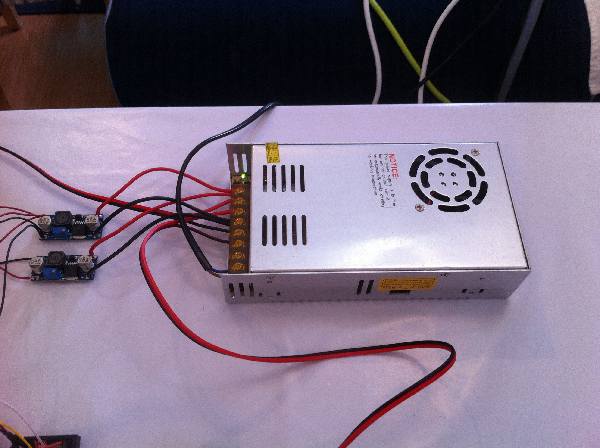
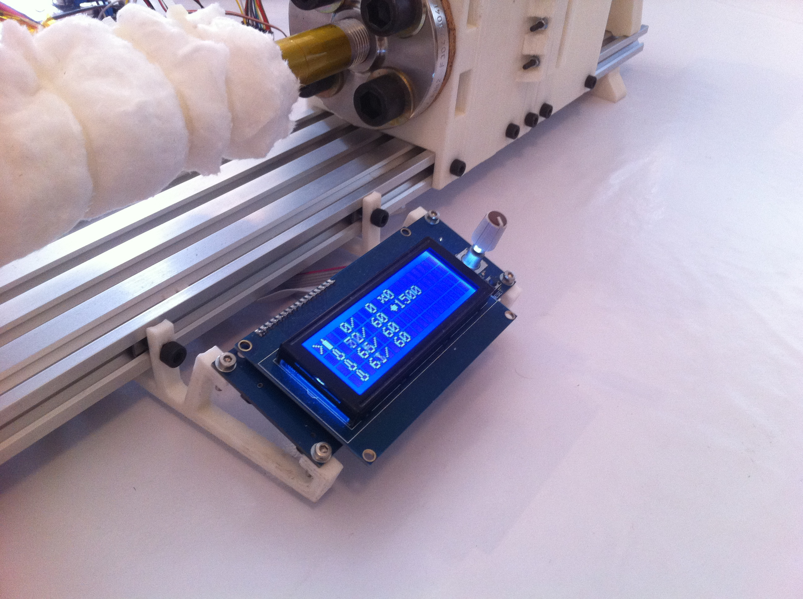
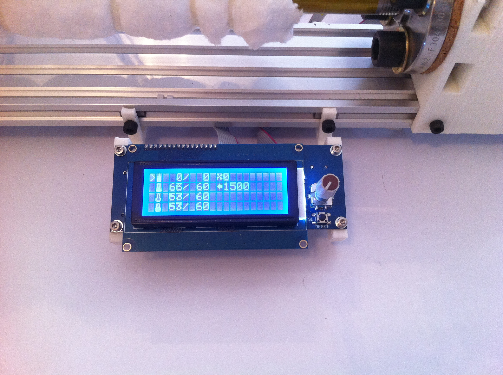

Filament Extruder
=================

Filament Extruder is a project dedicated to develop a simple, economic and easy to build filament extruding machine. It starts as an academic project at University Carlos III of Madrid.

Currently, the project is being prototyped and documented. The features of the present prototype are:

* Variable speed drive.
* Three independent temperature zones.
* Modular design, subsystems are mounted on an aluminium rail.
* Arduino controlled.
* LCD and encoder user interface.
* Variable speed pulling system.
* Fan cooling system.

Extruded product results have been documented to be:

* Filament usable for 3D printing.
* Up to 0.4 kg/h throughput.
* Up to +- 0.49 mm tolerance (quite bad result by now).

A video of the machine working can be found at http://youtu.be/RHb1_fSeXK4.

Images of the extrusion system:

*Extrusion line:*

*Puller and cooling fans:*

*Extruder and electronics:*

*Extruder body:*

*Electronics:*

*LCD+encoder interface:*

